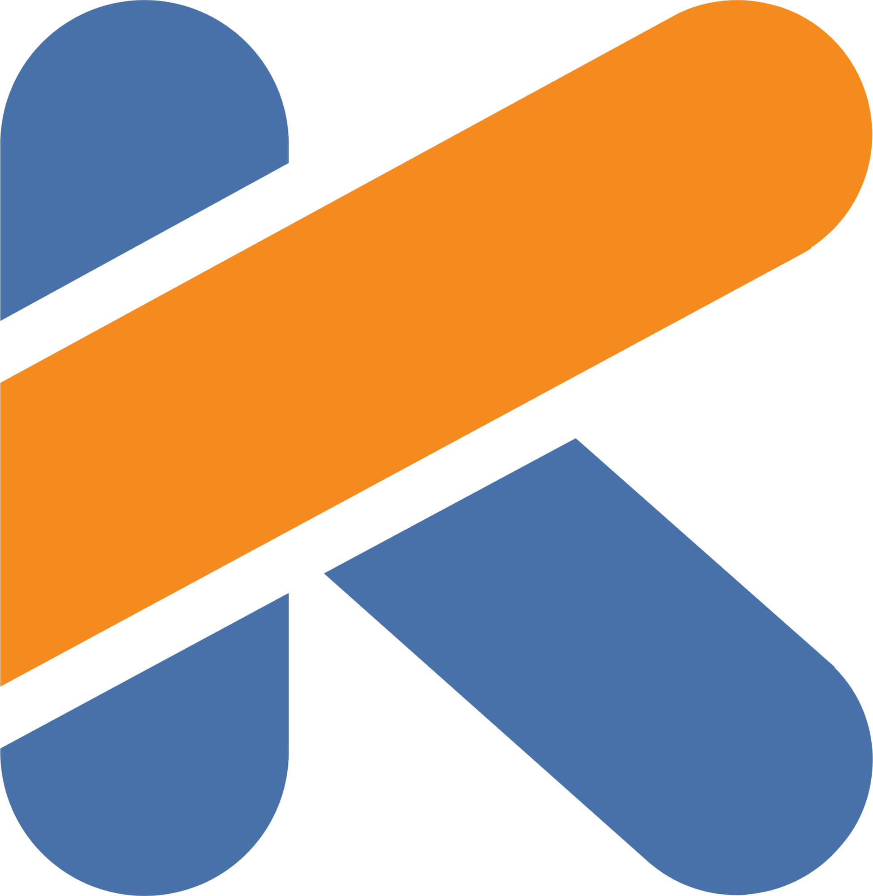

#  Hey There!!&nbsp;

  

#### I'm Itisha, 3RD Year Student at 👨‍💻 Maharaja Agrasen Institute Of Technology(MAIT), DELHI. Pursuing B.Tech .    I am an WEB Developer as well as a Competitive Programmer, obsessed with the idea of continuously improving myself.
  

## 🧐 About
- 🏢  I'm currently an undergrad student in EEE(Electrical and Electronics Engineering)+ MINROR in AIML (2022-2026)
- 🏄‍  I like to explore a new angle in existing ideas. 
- ✨  I love to build WEB applications based on unique ideas.
- 🌱  I love to learn new things and help others. 
- 🎨  Fun fact: Night time and good music boost my skills🌚.

#### 📫  How to reach me: mail me at [itishakofficial@gmail.com](mailto:itishakofficial@gmail.com)

 

##  🛠 Tech Stack

        

 

## Let's Connect🙌:

 
